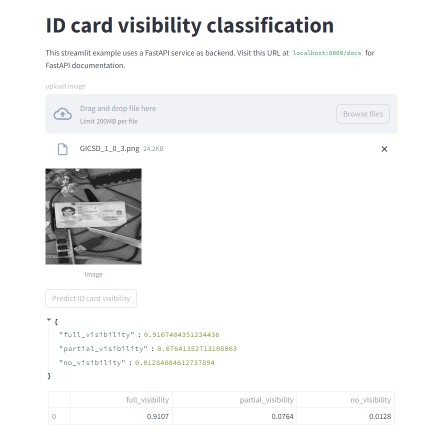

This is a template for machine learning model serving with [fastapi](https://fastapi.tiangolo.com/) in the backend and [streamlit](https://docs.streamlit.io/) in the frontend. Both apps run in separate dockerized containers.

In particular, this example serves an image classification api with fastapi. Streamlit app allows loading an image and calling the api for prediction. Classification result is shown in the web page as a json output and a table.

